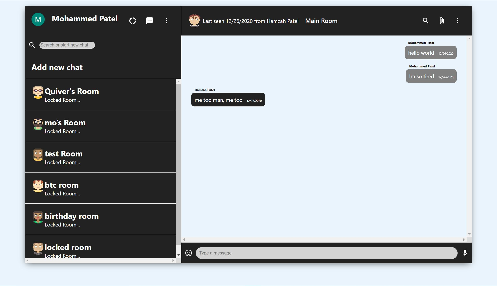

# Web-based Groupchat Box

## About
A groupchat web-app that allows users login and chat with other users in a global room. 

I built this to practice my full-stack development skills. This is a messenger web-app that has full front-end and back-end functionality.

From this project, I learned more about full-stack development (building REST APIs, testing, database and 3rd party platform usage), got better using powerful databases like MongoDB, learned more about express and nodejs, and much more.

## Languages and Tools

Front-end: React, Redux, HTML/CSS, Bootstrap, MaterialUI

Back-end: MongoDB, Express, Node, Pusher (enable real-time mongoDB usage), Firebase (Client-side hosting & authentication), Heroku (Server-side hosting)

Pusher was used to enable real-time usage of mongoDB so new messages pop up as people send them. Firebase was used to host the frontend of the web-app, while heroku was used to host the server-side of the web-app. They're hosted seperately but communicate to each through the use of packages like axios and cors. 